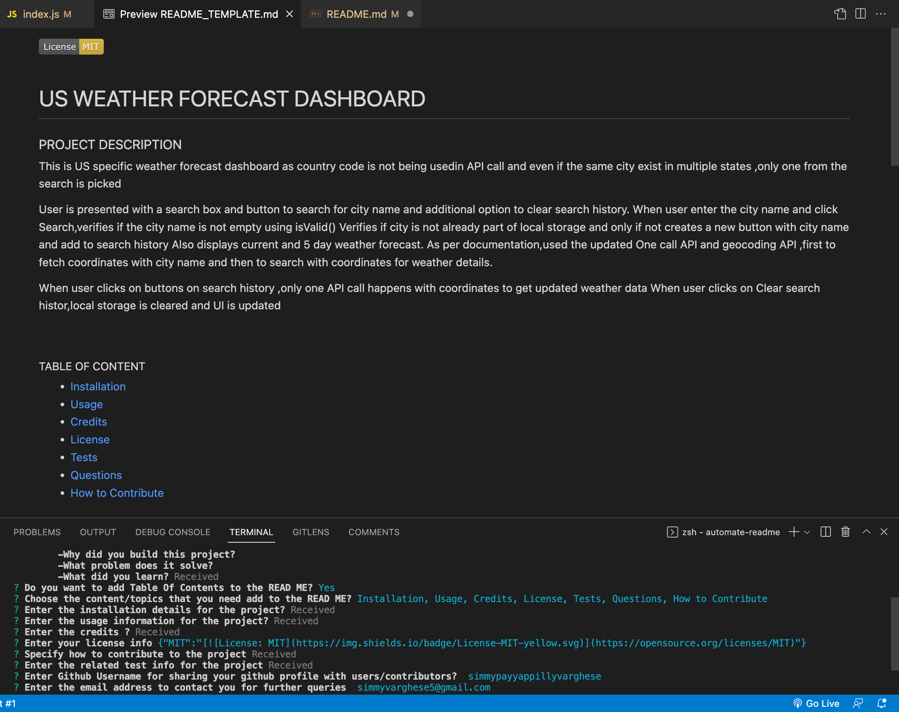

# AUTOMATE README

## Project Description

 

This is a README generator written in Node.js utilizing 'inquirer' and 'fs' package to generate ReadMe using 
the users input.User is prompted with following questions:
Project Title ,Validation added to verify user enters the title
Project Description,An editor opens up so user can enter multi line text
Table Of Content,Confirmation on whether user want to add a table of content to README or not
Content Choice List,List of choices for user to select the content that need to be added to the README
Installation ,Usage,Credits,Contribution,Test related info can be entered into an editor
License,User can choose the license from the list and its respective badge gets added to top of the READ Me
Github Username,Validates user enters a username and a github profile link is added to the README
Email,Validates if user enters a valid email id that is added to README
Once the readme iss succesfully generated,user gets a success message
 
 

### User Story
AS A developer I WANT a README generator
SO THAT I can quickly create a professional README for a new project

### Acceptance Criteria

GIVEN a command-line application that accepts user input

*   WHEN I am prompted for information about my application repository THEN a high-quality, professional README.md is generated with the title of my project and sections entitled Description, Table of Contents, Installation, Usage, License, Contributing, Tests, and Questions
*    WHEN I enter my project title THEN this is displayed as the title of the README
*    WHEN I enter a description, installation instructions, usage information, contribution guidelines, and test instructions THEN this information is added to the sections of the README entitled Description, Installation, Usage, Contributing, and Tests
*   WHEN I choose a license for my application from a list of options THEN a badge for that license is added near the top of the README and a notice is added to the section of the README entitled License that explains which license the application is covered under
*   WHEN I enter my GitHub username THEN this is added to the section of the README entitled Questions, with a link to my GitHub profile
*   WHEN I enter my email address   THEN this is added to the section of the README entitled Questions, with instructions on how to reach me with additional questions
*   WHEN I click on the links in the Table of Contents  THEN I am taken to the corresponding section of the README

 

### Links

* Video Link : https://drive.google.com/file/d/1f-Ab23NZOV19xtl7QpJosccnbw1fAxZn/view

* Github Repo Link : https://github.com/simmypayyappillyvarghese/automate-readme

 

### Technologies/Packages Used

 

* NODE.JS
* inquirer npm package
* fs package

 

### Screenshot

Below is how the Application is executed from terminal using comand node index

